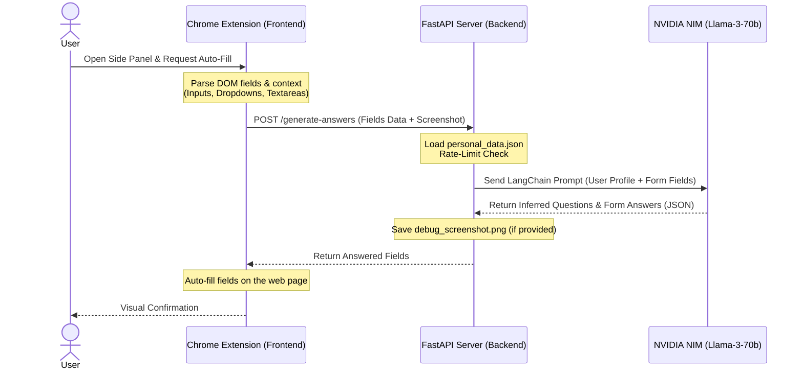

  # 🚀 Auto Apply AI Extension
An intelligent, AI-powered browser extension and backend assistant designed to automate job application form filling. Using a local user profile (RAG source of truth) and LangChain with NVIDIA NIM endpoints, the extension parses form elements (even inside the Shadow DOM) and generates context-aware answers to auto-fill applications.
---
## 🏗️ Architecture & How It Works
The system consists of three main components:
1. **Frontend (Chrome Extension)**: A modern, glassmorphic UI loaded in the Chrome Side Panel. It handles user authentication (simulated), job/form state inputs, and will orchestrate page DOM analysis.
2. **Backend (FastAPI Server)**: A secure Python-based REST API that processes form-field information, maintains CORS policies, and runs rate limiting to protect LLM resources.
3. **AI Agent (LangChain + NVIDIA NIM)**: A LangChain pipeline utilizing the `meta/llama3-70b-instruct` model on NVIDIA NIM to map form questions, input types, and field contexts to the user's structured personal data.
### 🔄 Data Flow

---
## 📂 Directory Structure
```text
├── backend/
│   ├── .env.example             # Template for API keys and config
│   ├── .env                     # Local environment file (API keys)
│   ├── agent.py                 # LangChain agent configuration and NVIDIA NIM setup
│   ├── main.py                  # FastAPI server with CORS, Rate Limiting, & Endpoints
│   ├── personal_data.json       # Structured profile file containing resume/personal info
│   └── requirements.txt         # Backend Python dependencies
│
├── frontend/
│   ├── manifest.json            # Chrome extension Manifest V3 configuration
│   ├── background.js            # Background service worker (side panel management)
│   ├── content.js               # Content script injected into pages (DOM parser placeholder)
│   ├── login.html / login.js    # Simulated extension login portal
│   ├── popup.html / popup.js    # Extension side panel user interface and API triggers
│   └── style.css                # Premium modern UI stylesheet (glassmorphism/gradients)
│
└── testing/
    └── test_form.html           # Mock application form including Shadow DOM for validation
```
---
## ✨ Features
- **Premium Side Panel UI**: Designed with glassmorphism, responsive elements, and clean animations using modern CSS typography (Inter).
- **RAG-based Context Matching**: Takes raw DOM fields (including placeholders, option lists, and adjacent labels) and matches them to a structured `personal_data.json` profile.
- **NVIDIA NIM Integration**: Uses LangChain and Nvidia NIM's optimized `meta/llama3-70b-instruct` model for lightning-fast inference and high accuracy.
- **Robust Security**:
  - **Rate Limiting**: Integrated `slowapi` to restrict endpoints to 10 requests per minute.
  - **CORS Configuration**: Restricts access to defined origins via the `.env` file.
- **Shadow DOM Support**: The test suite includes Shadow DOM elements to verify extension parsing capabilities in modern web apps.
---
## 🛠️ Getting Started
### 1. Backend Setup
1. **Navigate to the backend directory**:
   ```bash
   cd backend
   ```
2. **Create a virtual environment & activate it**:
   * **Windows (PowerShell)**:
     ```powershell
     python -m venv venv
     .\venv\Scripts\Activate.ps1
     ```
   * **macOS/Linux**:
     ```bash
     python3 -m venv venv
     source venv/bin/activate
     ```
3. **Install dependencies**:
   ```bash
   pip install -r requirements.txt
   ```
4. **Configure environment variables**:
   - Copy `.env.example` to `.env`.
   - Add your NVIDIA API Key (obtainable from [NVIDIA Build](https://build.nvidia.com/)):
     ```env
     NVIDIA_API_KEY=nvapi-your-key-here
     ALLOWED_ORIGINS=http://localhost:8000,chrome-extension://*
     ```
5. **Customize your profile**:
   - Open `backend/personal_data.json` and fill in your education, work experience, contact info, and skills.
6. **Start the FastAPI server**:
   ```bash
   uvicorn main:app --reload
   ```
   The backend will be available at `http://127.0.0.1:8000`.
---
### 2. Frontend (Extension) Setup
1. Open Google Chrome (or any Chromium browser).
2. Navigate to `chrome://extensions/`.
3. Enable **Developer mode** (toggle in the top-right corner).
4. Click **Load unpacked** in the top-left.
5. Select the `frontend` folder of this project.
6. Pin the **Auto Apply** extension to your toolbar.
---
## 🧪 Testing the Extension
1. Open `testing/test_form.html` in your browser.
2. Click on the Auto Apply extension icon to open the Side Panel.
3. Log in (a simulated dashboard will load).
4. The extension handles complex fields:
   - Text inputs (Full Name, Email)
   - Select dropdowns (Job Role)
   - Radio buttons & Checkboxes (Experience level, skills)
   - Textareas (Cover Letter)
   - Elements inside the **Shadow DOM** (Shadow Key, Shadow Checkbox)
---
## 🚧 Roadmap & Current Notes
- **Content Script Implementation**: The file [content.js](file:///d:/Auto-Apply-Extension/auto-apply-extension/frontend/content.js) serves as a placeholder. Future development includes adding DOM traversal logic to automatically extract inputs from web pages and inject the answers returned from the backend `/generate-answers` endpoint.
- **Resume Tailoring integration**: The popup is currently configured to send queries to a `/fresher_resume_builder` route. To align form filling with resume generation, configure backend endpoints in [main.py](file:///d:/Auto-Apply-Extension/auto-apply-extension/backend/main.py) to support document output generators.
